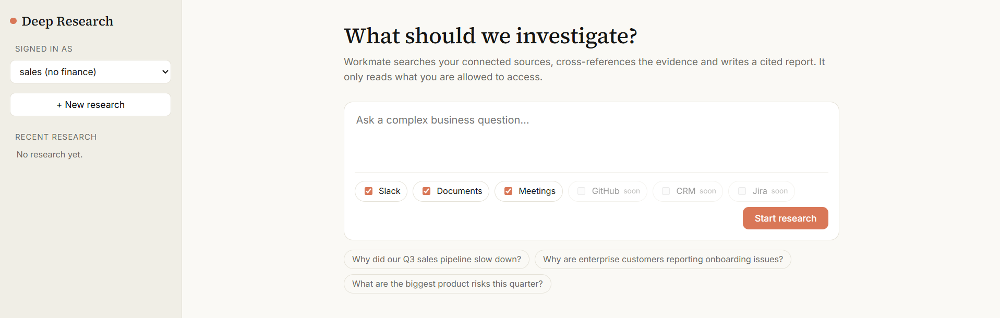

# 🔎 Deep Research: Question to Cited Research Report

[](https://python.org) [](https://fastapi.tiangolo.com) [](https://groq.com)

A proof of concept for a Workmate feature that turns a complex business question into a structured research report. Instead of answering from a single search, it plans the research, searches several connected sources, cross-references the evidence, and writes a report where every claim links back to its source. It only searches data the signed-in user is allowed to access.



---

## 🔍 The Problem

Asking "why did our Q3 pipeline slow down?" is not a lookup. The answer is spread across Slack threads, customer calls, and internal documents, and a single semantic search returns fragments without connecting them. General-purpose LLMs also fill gaps with plausible but unsupported explanations, and a research tool that leaks restricted content is worse than none.

This project investigates in multiple steps, separates evidence from inference, drops any claim that has no supporting source, and applies per-user permissions inside the search itself.

---

## 🧠 How It Works

```
Research Question
        │
        ▼
┌─────────────────────┐
│       Planner       │  5 to 8 dynamic research areas, 2 to 4 queries each
└────────┬────────────┘
         │  areas + queries
         ▼
┌─────────────────────┐
│  Source Searchers   │  every query x every selected source, RBAC inside search
└────────┬────────────┘
         │  raw evidence
         ▼
┌─────────────────────┐
│  Evidence Collector │  dedupe by URL, tag each item with its research area
└────────┬────────────┘
         │  grouped evidence
         ▼
┌─────────────────────┐
│     Groq LLM        │  findings, patterns, potential causes (JSON mode)
└────────┬────────────┘
         │  structured analysis
         ▼
┌─────────────────────┐
│      Validator      │  drops claims without valid evidence ids, caps confidence
└────────┬────────────┘
         │  validated analysis
         ▼
┌─────────────────────┐
│   Report Generator  │  summary, recommendations, sources, stats
└────────┬────────────┘
         │
         ▼
   Executive Summary + Findings + Patterns + Causes + Recommendations + Sources
         │
         ▼
┌─────────────────────┐
│    Frontend UI      │  live step progress, evidence cards, source drawer, history
└─────────────────────┘
```

All stages read and write one `Research` object, so the API and UI only need to read that object.

---

## ✨ Features

- **Dynamic question decomposition**: research areas and search queries are generated per question, not hardcoded
- **Multi-source search**: Slack, Documents, and Meetings today, with a connector interface for GitHub, CRM, Jira, and Gmail
- **Cross-source analysis**: patterns and causes combine evidence from different sources
- **Evidence vs inference**: findings are labelled `Evidence` or `Inference`, and causes are always shown as inferences
- **No unsupported claims**: any finding, pattern, cause, or recommendation without valid evidence ids is removed in code
- **Honest confidence**: causes backed by a single source are capped at 0.5 in code
- **Explicit no-answer**: if the evidence does not relate to the question, the report says so instead of stretching
- **Permission-aware search**: the user is passed into every connector call, so blocked content never reaches the LLM
- **Live progress**: each research step and the current search are shown, not a spinner
- **Clickable citations**: click a source number to open the original snippet and its reference
- **Research history**: reopen any past report
- **Safe rendering**: model output is escaped before it is inserted into the page

---

## 📁 Project Structure

```
deep_research/
├── app/
│   ├── main.py          # FastAPI routes, serves the frontend
│   ├── models.py        # Research, Evidence, Finding, Step
│   ├── pipeline.py      # orchestrator, status and step updates
│   ├── planner.py       # question decomposition
│   ├── analyzer.py      # grouping, cross-referencing, validation, report
│   ├── connectors.py    # Connector interface, mock connectors, REGISTRY
│   ├── llm.py           # Groq JSON client
│   ├── rbac.py          # demo users and access check
│   ├── store.py         # in-memory research store
│   └── seed_data.py     # mock Slack, document, and meeting data
├── static/
│   └── index.html       # frontend
├── docs/
│   └── screenshot.png
├── test_research.py     # 7-case end-to-end test suite
├── requirements.txt
└── README.md
```

---

## 🚀 Run Locally

Requires Python 3.10+ and a free Groq API key from [console.groq.com](https://console.groq.com).

```
cd deep_research
pip install -r requirements.txt
```

Create `.env`:

```
GROQ_API_KEY=your_key_here
GROQ_MODEL=openai/gpt-oss-120b
```

Start the app:

```
python -m uvicorn app.main:app --reload
```

Open `http://127.0.0.1:8000`. Interactive API docs are at `/docs`.

Without an API key the app still runs, using a fixed planner and a simple per-area summary.

To see permissions working, pick `intern` in the top-left dropdown and run the same question as `admin`. Restricted channels and documents disappear from the evidence.

---

## 💡 Example

**Question:**

```
Why did our Q3 sales pipeline slow down?
```

**Output (abridged):**

| Potential cause                          | Sources             | Confidence |
| ---------------------------------------- | ------------------- | ---------- |
| Reduced sales capacity                   | Slack, Docs, Meetings | 0.80     |
| Competitive pricing pressure             | Slack, Meetings     | 0.70       |
| Onboarding delays from process changes   | Docs, Slack, Meetings | 0.60     |

**Evidence (finding):** Average onboarding time rose from 21 to 38 days after the August process change. Source: Documents, `q3-customer-analysis`, page 14.

**Inference (cause):** Longer onboarding likely slowed the enterprise pipeline. Each cause lists the evidence ids it rests on, and clicking one opens the original snippet.

---

## 🔌 API

All routes take the header `X-User-Id` (demo auth only).

| Method | Path                          | Body                                              | Returns                                                     |
| ------ | ----------------------------- | ------------------------------------------------- | ----------------------------------------------------------- |
| POST   | `/api/research`               | `{"question": "...", "sources": ["slack", ...]}`  | `{"research_id": "..."}`                                    |
| GET    | `/api/research/{id}`          | none                                              | status, areas, queries, evidence, findings, report          |
| GET    | `/api/research/{id}/progress` | none                                              | `{"status": "...", "steps": [{name, status, detail}]}`      |
| GET    | `/api/research`               | none                                              | history for the current user, newest first                  |

Status values: `queued`, `planning`, `searching`, `collecting_evidence`, `analyzing`, `generating_report`, `completed`, `failed`.

Data model:

```
Research  id, user_id, question, sources, status, steps, areas, queries,
          evidence, findings, report, error, created_at
Evidence  id, source_type, reference, date, snippet, url, research_area, score
Finding   kind (evidence | inference), statement, evidence_ids, confidence
Step      name, status (pending | running | done), detail
```

---

## 🛡️ Trust Model

| Rule                        | How it is enforced                                                              |
| --------------------------- | ------------------------------------------------------------------------------- |
| No unsupported claims       | Items without valid evidence ids are dropped in `analyzer.py`                   |
| Evidence vs inference       | Findings carry `kind`, and causes are always labelled as inferences             |
| Honest confidence           | Single-source causes are capped at 0.5 in code                                  |
| No guessing on missing data | The analyzer can return `answerable: false`, and the report states no evidence  |
| Counts are not LLM-written  | Stats are computed in code                                                      |
| Permissions                 | `user` is passed into every `connector.search`, filtering happens before the LLM |
| Report ownership            | Research objects are readable only by their owner (404 otherwise)               |

---

## ⚙️ Tech Stack

| Component      | Tool                          |
| -------------- | ----------------------------- |
| Frontend       | HTML, CSS, vanilla JavaScript |
| Backend        | FastAPI, Pydantic, Uvicorn    |
| LLM inference  | Groq API (GPT-OSS, JSON mode) |
| Data (POC)     | In-memory store, mock sources |

---

## 📦 Installation

`requirements.txt`:

```
fastapi
uvicorn
pydantic
groq
python-dotenv
```

| Variable       | Required | Description                                      |
| -------------- | -------- | ------------------------------------------------ |
| `GROQ_API_KEY` | Yes      | Groq API key                                     |
| `GROQ_MODEL`   | No       | Groq model ID, defaults to `openai/gpt-oss-120b` |

Adding a connector: subclass `Connector`, implement `search(query, user)`, and register it in `REGISTRY`. Nothing else changes.

---

## ✅ Testing

```
python test_research.py
```

Runs 7 questions through the real pipeline and writes `test_results.md`. Current result: **78/78 checks pass**.

| # | User   | Question                                                  | Purpose                              |
| - | ------ | --------------------------------------------------------- | ------------------------------------ |
| 1 | admin  | Why did our Q3 sales pipeline slow down?                  | Main scenario                        |
| 2 | admin  | Why are enterprise customers reporting onboarding issues? | Cross-source onboarding evidence     |
| 3 | admin  | What are the biggest product risks this quarter?          | Different domain                     |
| 4 | admin  | Why is mid-market churn increasing?                       | Churn, pricing, and product signals  |
| 5 | admin  | How is sales team capacity affecting our Q3 results?      | Confidential finance document used   |
| 6 | intern | Why did our Q3 sales pipeline slow down?                  | Restricted resources must not appear |
| 7 | admin  | What is our office parking policy?                        | No relevant evidence, nothing invented |

Per case it checks that sources were searched, evidence was found, findings were generated, every citation resolves to real evidence, a cross-source pattern exists, evidence and inference are labelled, single-source confidence is capped, and no blocked resource appears. The checks verify structure, so each summary still needs a human read for meaning.

---

## ⚠️ Limitations

- Connectors search a small seed dataset by keyword stem, which returns weak matches. A real semantic search is needed.
- Citations are checked for existence, not meaning. A cited snippet may not truly support its claim.
- Inference can stretch. Confidence is capped, but the wording can still be stronger than the evidence.
- Single pass: the agent does not run follow-up searches when the first pass leaves gaps.
- Each evidence item is tied to one research area, so area stats are approximate.
- Restricted users get partial answers, and the UI does not say that some data was inaccessible.
- In-memory history, background tasks instead of a job queue, polling instead of SSE, header-based demo auth, and no LLM retry handling.
- Source links are Workmate references, not real deep links.

## 🛣️ Roadmap

- Plug into Workmate search/RAG and the existing RBAC layer, then add GitHub, Jira, CRM, and Gmail connectors
- Iterative loop that detects gaps and contradictions, then searches again
- Claim verification pass between each claim and its cited snippet
- "Some sources were not accessible to you" notice without revealing their content
- Many-to-many evidence-to-area mapping, ranked by recency and source reliability
- SSE progress, persistent storage, job queue, cancel and re-run
- Real deep links to Slack threads, documents, and meeting timestamps
- Report export to PDF or doc
- Labelled evaluation set to track hallucination and citation accuracy